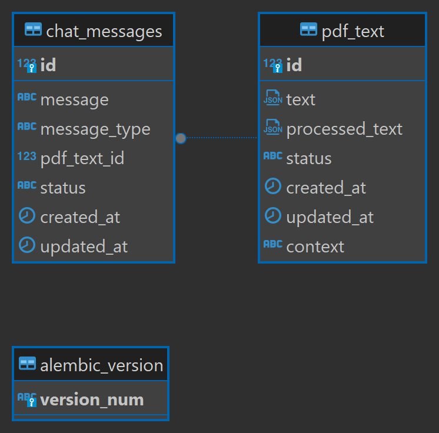

# PDF Gemini

PDF Gemini is a web application designed to handle PDF documents, allowing users to upload a PDF, ask questions related to its content, and receive answers along with corresponding page numbers. This document outlines the architecture, design choices, and usage instructions for the project.

## Table of Contents

1. [Architecture](#architecture)
    - [Backend](#backend)
    - [Frontend](#frontend)
2. [Design Choices](#design-choices)
3. [Usage Instructions](#usage-instructions)
4. [Database Schema](#database-schema)

## Architecture

### Backend

The backend is built using FastAPI, SQLAlchemy, and Alembic. It handles the following tasks:

- **PDF Upload Endpoint**: An endpoint (`/upload_file`) accepts a PDF and an optional PDF description. The PDF is read using PyMuPDF, processed, and stored in the database. A Semantic Search Model is created using KNN for each PDF.
- **Question Answering API**: This API receives a question, retrieves previous messages and the model from the database, finds the neighbors using Semantic Search, sends the query to Gemini (using generative language), obtains the answer, saves it in the database, and sends the response.


### Frontend

The frontend is developed using NextJS and includes the following features:

- **PDF Upload**: A user interface to upload a PDF.
- **Question Input**: A text input field to accept questions from the user.

## Design Choices

1. **FastAPI**: Chosen for its performance and ease of use in building APIs.
2. **SQLAlchemy and Alembic**: Used for database management and migrations to ensure data integrity and ease of schema evolution.
3. **PyMuPDF**: Selected for its efficient PDF processing capabilities.
4. **KNN for Semantic Search**: Provides a robust method for finding relevant content in the PDF.
5. **NextJS**: Chosen for its seamless integration with React and its ability to build highly interactive user interfaces.

## Usage Instructions

1. **Setup Backend**:
    - Install dependencies:
      ```bash
      pip install -r requirements.txt
      ```
    - Run database migrations:
      ```bash
      alembic upgrade head
      ```
    - Start the FastAPI server:
      ```bash
      uvicorn main:app --reload
      ```

2. **Setup Frontend**:
    - Navigate to the `frontend` directory:
      ```bash
      cd frontend
      ```
    - Install dependencies:
      ```bash
      npm install
      ```
    - Start the NextJS development server:
      ```bash
      npm run dev
      ```

3. **Uploading a PDF**:
    - Navigate to the upload page on the frontend.
    - Upload a PDF document and provide an optional description.
    - The PDF will be processed, and the data will be stored in the database.

4. **Asking Questions**:
    - Use the text input field on the frontend to ask questions about the uploaded PDF.
    - Receive answers with corresponding page numbers.

## Database Schema


By following these instructions, you can set up and run the PDF Gemini application, enabling users to upload PDFs and ask questions related to their content efficiently.